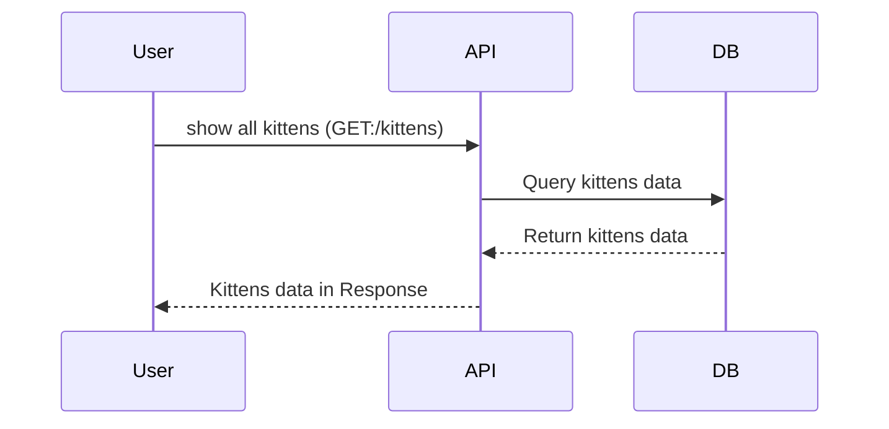
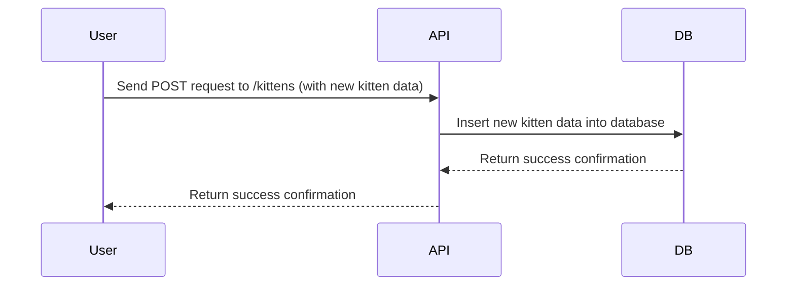

# Kittens FastAPI API

This API allows you to manage information about adorable kittens that is stored in a PostgreSQL database. You can perform basic CRUD (Create, Read, Update, Delete) operations on kittens records.

## Setup

1. Clone the repository on the local machine using this command:

```
git clone https://github.com/merry-mouse/database_rest_api.git
```

2. Navigate to the project directory:

```
cd kittens-fast-api
```

3. Create virtual environment and activate it:

```
python3 -m venv venv
source venv/bin/activate
```

4. Install required dependencies:

```
pip install -r requirements.txt
```

5. Set up a PostgreSQL database using Docker:

```
docker run --name kittens-postgres -e POSTGRES_PASSWORD=mysecretpassword -p 5432:5432 -d postgres
```

6. Run FastAPI application:

```
uvicorn main:app --reload
```

7. You can use an API platform like Postman, but since we are using FastAPI, it is easier to use automatic Swagger documentation for FastAPI. If uvicorn is running without an error, you can access documantation via this link:

```
http://127.0.0.1:8000/docs
```

## API endpoints

- **GET:** _/kittens_ -> Get a list of **all** kittens.
- **GET:** _/kittens/{kitten_id}_ -> Get detailed about a specific kitten
- **POST:** _/kittens_ -> Add a new kitten to the database
- **PUT** _/kittens/{kitten_id}_ -> Update kitten details
- **DELETE** _/kittens/{kitten_id}_ -> Delete a kitten from the database

## Usage example

### Add New Kitten

The database is empty now, that's why first of all we need to add some new kittens there.
Make a POST request to http://127.0.0.1:8000/kittens with some JSON data.
Example:

```
{   "id": 1,
    "name": "Pukko",
    "age": 1,
    "color": "grey-brown-black",
    "fur": "long"
}
```

Add another kitten with similar POST request, so we have several kittens in the database:

```
{
    "id": 2,
    "name": "Shanti",
    "age": 3,
    "color": "grey-brown-black",
    "fur": "short"
}
```

### Get All Kittens

Make a GET request to http://127.0.0.1:8000/kittens to get a list of all kittens in the database

### Get Kitten Details

Make a GET request to http://127.0.0.1:8000/kittens/{kitten_id} to get details about a specific kitten.

### Update Kitten Details

Make a PUT request to http://127.0.0.1:8000/kittens/{kitten_id} with updated JSON data to update kitten details.
Example:

```
{   "id": 2,
    "name": "Shanti",
    "age": 3,
    "color": "black",
    "fur": "long"
}
```

### Delete Kitten

Make a DELETE request to http://127.0.0.1:8000/kittens/{kitten_id} to delete a kitten from the database.

## Technologies used

- FastAPI: A modern, fast and simple web framework for building APIs with Python.
- SQLAlchemy: An SQL toolkit and Object-Relational Mapping (ORM) library.
- Docker: A platform to develop, ship and run applications in containers.
- PostgreSQL: A powerful, open-source relational database management system.

## Sequence Diagrams

### Get All kittens



### Create a new kitten


